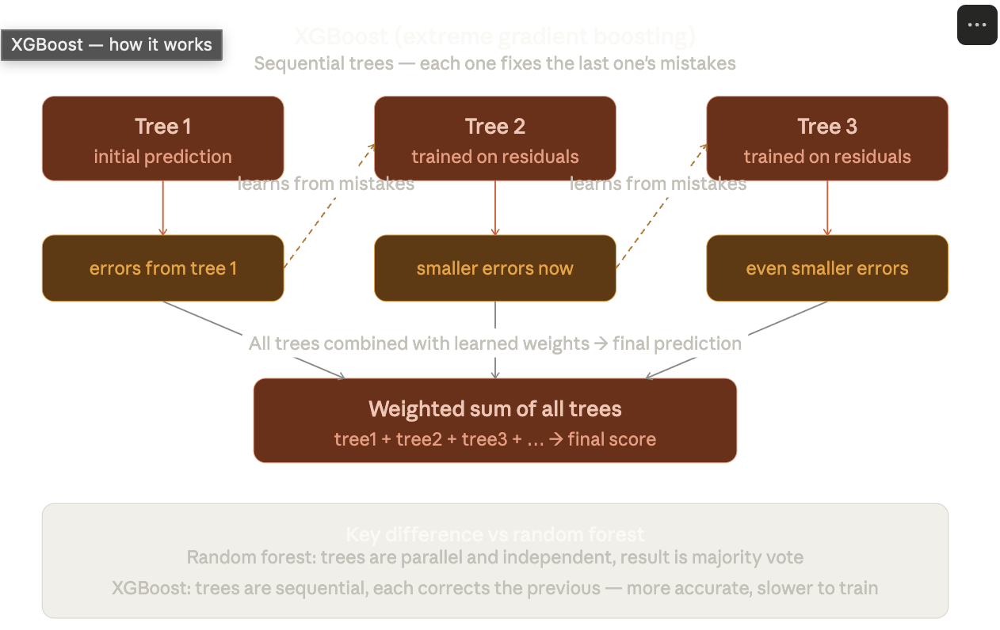
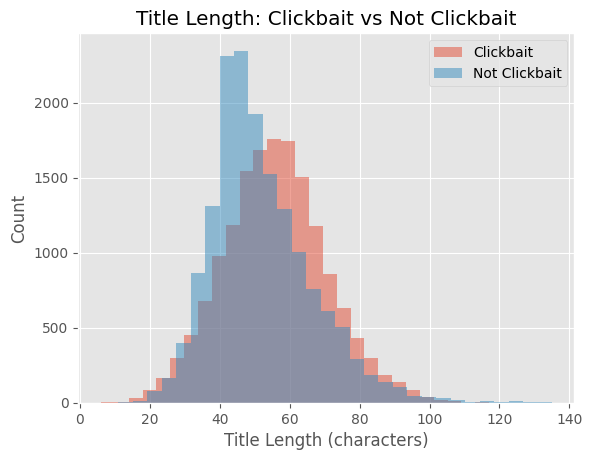
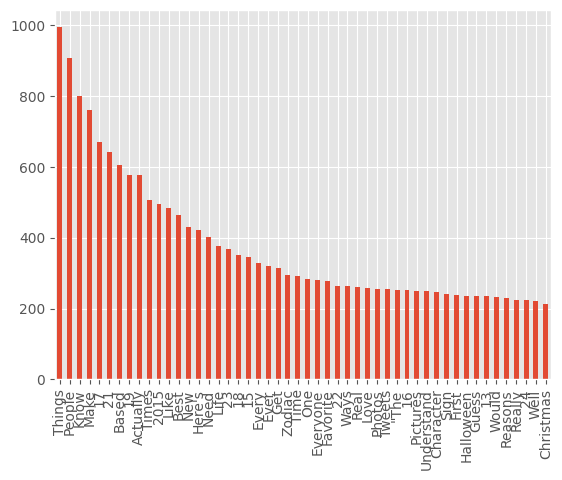

  

Not Clickbait: An end-to-end Machine Learning web application built to classify news headlines as 'Clickbait' or 'Not Clickbait', 94.5% accuracy.

## Project Overview and Motivation

To be totally honest, the code in my project is very concise and that is by intention. This was my first time doing anything ML-related so I spent the bulk of time watching videos/reading about the typical workflow of ML Projects. I also have an interest in data science so I spent some time reviewing the Pandas and Numpy Libraries while graphing/visualizing interesting parts of the data set.

The data set involved 32,000 clickbait titles that were binarily classified.

I feel from this project I have a better grasp of the typical ML workflow. In the future, I want do some more data science/ML projects with more complex datasets.

  

Training was a 80/20 split. 

## Why TF-IDF Vectorization?
ML models cannot read text; instead they rely on numerical features. TF-IDF Vectorization mathematically weights the importance of each word. Term Frequency rewards words that appear more frequently while IDF penalizes common English words and rewards rare, signature words.

# Why XGBoost?
I settled on using XGBoost rather like simple logistical regression as it works by continually build simple decisions trees then building new trees by analyzing the errors it made. Furthermore, it is more memory-efficient while working with the data stored in the spare matrix from the IDF Vectorizer. XGBoost is also designed to prevent overfitting.

Training was a 80/20 split. 

## Streamlit Application
The Streamlit application loads both the serialized model and vector to perform live prediction on user-inputted titles. I also added a heatmap to visualize which words the models as important.

## How it Works

* **Preprocessing:** Cleans text using Regex and vectorizes it using TF-IDF (Term Frequency-Inverse Document Frequency).
* **Model:** Uses an XGBoost Classifier trained on a custom dataset (80/20 train/test split).
* **Interface:** Streamlit Application

## Future Plans
Some future things I'd like to do:
+ Incorporate another dataset
+ Move to Deep Learning and implement BERT(Bidirectional Encoder Representations from Tranformers). BERT would need to be implemented with Pytorch or Hugging Face. The idea is that one limitation with the current model is that it views words as isolated features. In each sentence the weights of the words are examined individually when they are vectorized.  To be honest, this is the next thing I want to work on and I think it would be interesting to see if the accuracy could be approved uing a model that examined the relationships and context rather than a traditional 'bag of words' nlp model.

+ plans to turn this into a chrome extension that could display the probabilty of each article being clickbait on Chrome. I also identified areas where the model struggles including ambigious titles.

## Data Visualization

  

