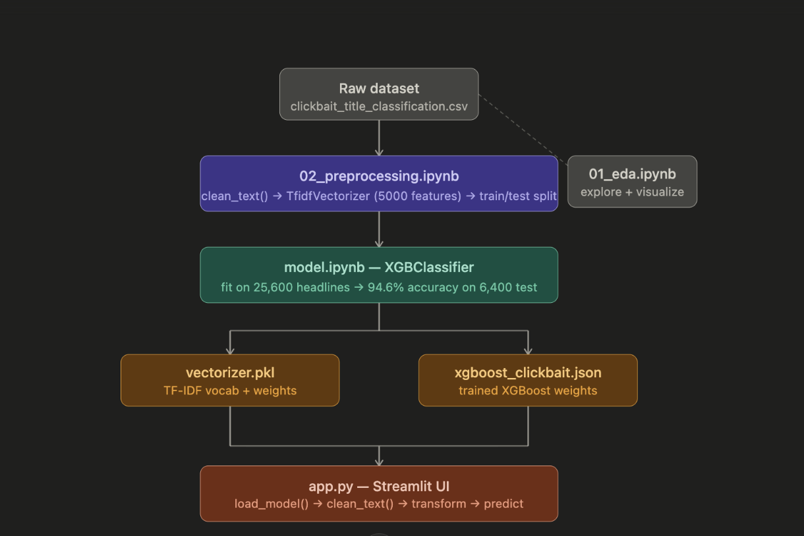

Not Clickbait: An end-to-end Machine Learning web application built to classify news headlines as 'Clickbait' or 'Not Clickbait', 94.5% accuracy.

To be totally honest, the code in my project is very concise and that is by intention. This was my first time doing anything ML-related so I spent the bulk of time watching videos/reading about the typical workflow of ML Projects. I also have an interest in data science so I spent some time reviewing the Pandas and Numpy Libraries while graphing/visualizing intersting parts of the data set.

In the future, I have plans to turn this into a chrome extension that could display the probabilty of each article being clickbait on Chrome. I also identified areas where the model struggles: this includes ambigious titles.

-Incorporate another dataset
-Sentencepiece(LLMS use)

I settled on using XGBoost rather like simple logistical regression as it works by continually build simple decisions trees then building new trees by analyzing the errors it made.

Training was a 80/20 split. 

* **Preprocessing:** Cleans text using Regex and vectorizes it using TF-IDF (Term Frequency-Inverse Document Frequency).
* **Model:** Uses an XGBoost Classifier trained on a custom dataset (80/20 train/test split).
* **Interface:** Streamlit Application

  

