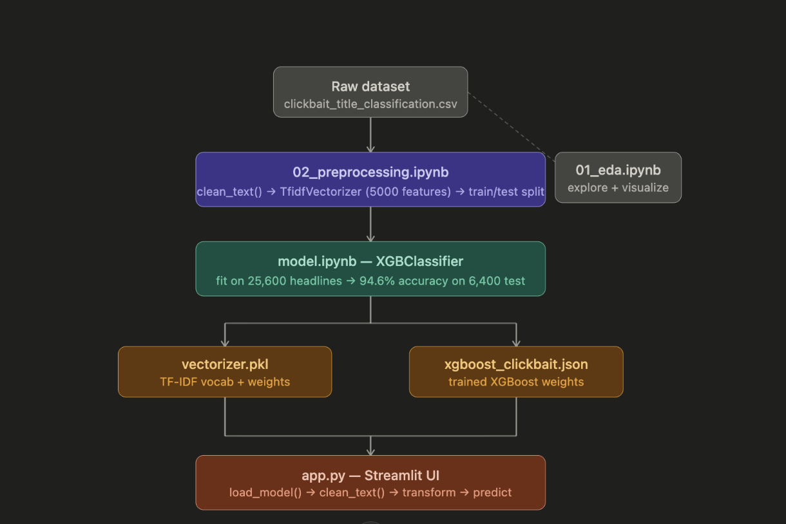
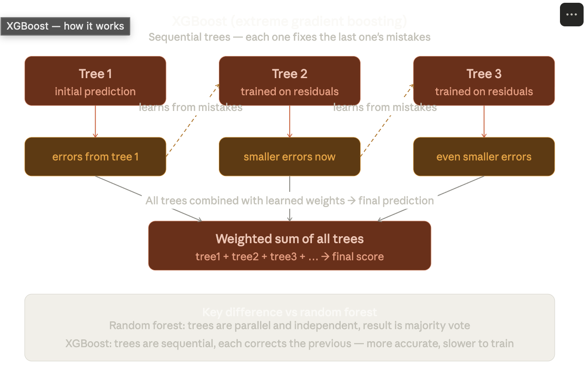
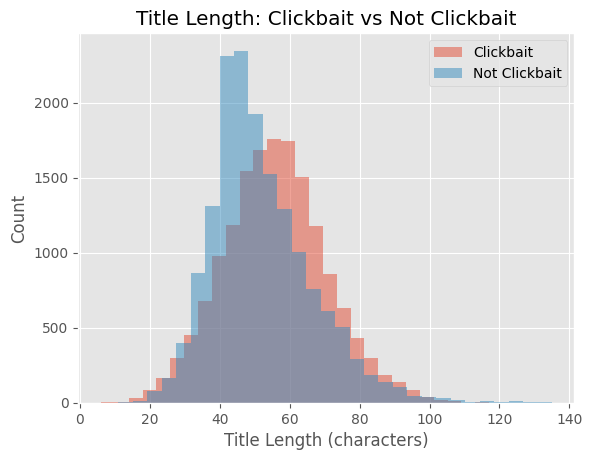
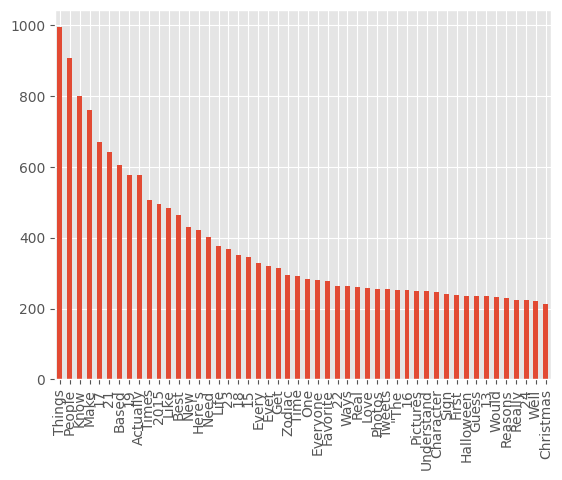

# Not Clickbait

An end-to-end machine learning web application built to classify news headlines as **Clickbait** or **Not Clickbait**, achieving 94.5% accuracy.

## Project Overview and Motivation

This project was my first end-to-end machine learning application, so I focused on understanding the typical ML workflow: exploratory data analysis, preprocessing, feature extraction, model training, evaluation, and deployment. I also used the project to strengthen my understanding of pandas and NumPy while graphing and visualizing patterns in the dataset.

The dataset contained 32,000 news headlines that were binary classified as clickbait or not clickbait.

Through this project, I developed a stronger understanding of the machine learning workflow and gained experience building a complete application around a trained model. In the future, I want to explore more data science and machine learning projects with larger and more complex datasets.

  

Training used an 80/20 train-test split.

## Why TF-IDF Vectorization?

Machine learning models cannot directly interpret text, so text data must be converted into numerical features. TF-IDF vectorization weights the importance of each word by considering both how frequently it appears in a document and how common it is across the full dataset. Term frequency rewards words that appear more often in a given headline, while inverse document frequency penalizes common words and emphasizes more distinctive terms.

## Why XGBoost?

I chose XGBoost over a simpler model such as logistic regression because it builds decision trees sequentially, with each new tree learning from the errors of the previous ones. This makes XGBoost effective for capturing nonlinear patterns in the data. It is also memory-efficient when working with sparse matrices created by TF-IDF vectorization and includes regularization techniques designed to reduce overfitting.

## Streamlit Application

The Streamlit application loads both the serialized model and vectorizer to perform live predictions on user-inputted headlines. I also added a heatmap to visualize which words the model identifies as important.

## How It Works

* **Preprocessing:** Cleans text using regular expressions and vectorizes it using TF-IDF.
* **Model:** Uses an XGBoost classifier trained on a labeled dataset with an 80/20 train-test split.
* **Interface:** Provides an interactive Streamlit application for live headline classification.

## Future Plans

Some future improvements I would like to explore include:

* Incorporating an additional dataset to improve generalization.
* Implementing a deep learning model such as BERT (Bidirectional Encoder Representations from Transformers) using PyTorch or Hugging Face. One limitation of the current model is that it treats words as isolated features through a traditional bag-of-words NLP approach. A transformer-based model could better capture context and relationships between words, potentially improving accuracy.
* Turning the application into a Chrome extension that displays the probability of each article being clickbait directly in the browser.
* Further analyzing areas where the model struggles, including ambiguous headlines.

## Data Visualization

  

